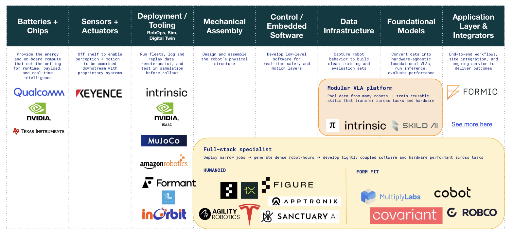

# Physical AI & Robotics — Investment Landscape

I'm drawn to challenges where the constraint isn't intelligence
itself, but the conditions required for intelligence to work. That
framing shaped my interest in AI deployment in emerging markets,
where the gap between what models can do and what actually reaches
users comes down to infrastructure, data availability, and
distribution. It's also what pulled me toward physical AI. The
physical world is the hardest version of that problem.

When I was a Special Projects Associate at Google X, the Everyday
Robots group had their robotic arm farms set up throughout the X
hangar in Mountain View. Alphabet deprecated Everyday Robots in
February 2023. The project didn't offer a clear path to becoming a
profitable, large-scale revenue generator. It may have been the right
decision then. But I couldn't help wondering how Everyday Robots
would have fared in this world. With physical AI and hardware-enabled
software as the topics du jour, I decided to investigate.

---

**Thesis in one line:**

The near-term value in robotics accrues to integrated players who
run fleets, own proprietary data flywheels, and sell reliability.
The long-term opportunity is in the software layers that make
intelligence transferable across any body.

---

**Three open questions structuring the landscape:**

**01. Full-stack or modular?**

Integrated players win now. Deploying narrow jobs generates the
dense robot-hours needed to build proprietary data flywheels. But
if general VLAs commoditize the brain, value shifts toward modular
platforms, operators who harness them, and the enablement layers
in between.

**02. Humanoid or form-fit?**

Capital is betting on humanoids as the default design. Economics
still favor form-fit. Humanoids make sense when the job requires
stairs, doorways, or human tools without re-fixturing. Form-fit
wins where throughput, cost, and uptime dominate, which is most
deployments today.

**03. Enterprise or consumer?**

Enterprise wins now. Clear ROI, centralized buyers, structured
environments. Consumer faces cost, reliability, and trust hurdles
that aren't close to being solved.

---

**Where the investable software bets are**

At pre-seed, the opportunity is in software that compounds with
deployment and architecture innovation, not hardware. Three
whitespaces stand out.

Cross-OEM RobOps. A unified platform to monitor, debug, and log
heterogeneous fleets across robot brands and body types.

Simulation infrastructure. A cloud-agnostic simulator that closes
the gap between NVIDIA Isaac's scale and MuJoCo's physics fidelity.

Model and Skills Hub. A vendor-agnostic repository to find, test,
and reuse pre-trained skills with clear licenses and benchmarks.
The Hugging Face of embodied AI.

---

**Key players mapped**

Covers the full value chain from batteries and chips through to
application layer and integrators, including Physical Intelligence,
Figure AI, 1X, Agility Robotics, Intrinsic, Covariant, Multiply
Labs, and more.

---

**About**

Research on the physical AI landscape and where software bets make sense. Informed by time at Google X and early venture investing in deep tech. Written to think clearly about the stack, the constraints, and the investable opportunities.

📎 [LinkedIn](https://linkedin.com/in/princess-adentan-85989199)
